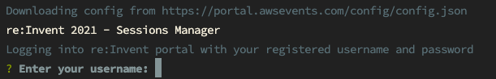
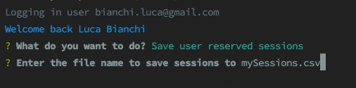

# RESM -- re:Invent 2021 Schedule Manager
> A command line tool to manage your schedule for re:Invent 2021.

## Introduction 
This year re:Invent is going to be back in person with a [brand new portal](https://portal.awsevents.com/events/reInvent2021/dashboard)
Here are a series of utilities related to session handling.

## Export Sessions to CSV or ICS
Unfortunately, the portal does not allow to export booked sessions to a CSV or ICS file.

## How to use

Using the command line tool is super easy, just run the following command:

```bash
npm i -g resm
```

then start the tool with the following command:

```bash
resm
```
and follow the instructions, entering your re:Invent porta **username** and **password** when prompted.





And finally, choose the export format you want.
